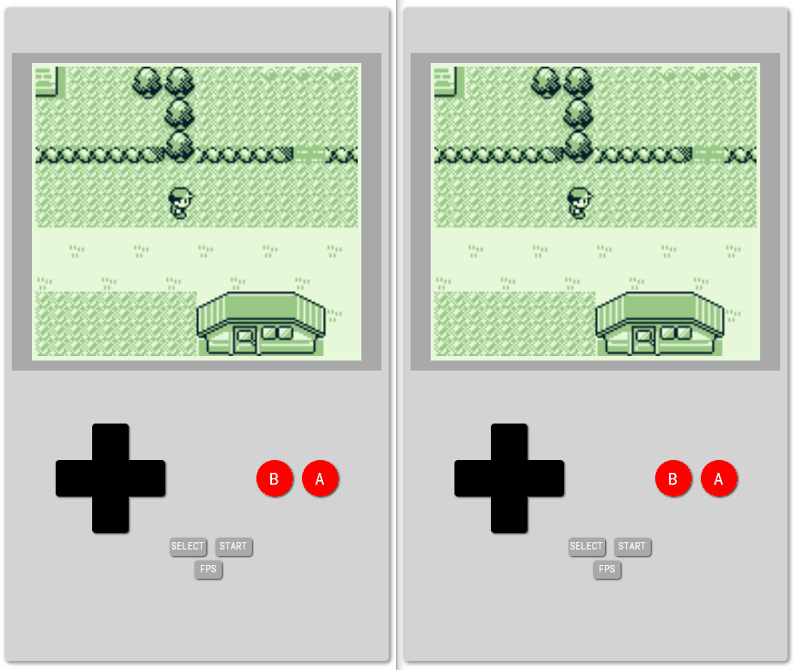

# CoGB
Co-op gameboy written in .NET Core and Java.

(Only tested with Pokemon Red)

# Getting Started
* Open [CoGB.Web.sln](CoGB.Web/CoGB.Web.sln) in Visual Studio and start debugging
* Open Powershell and set environment variable 
    `$env:GBSignalR = "http://localhost:5000/hubGame"`
* Follow the `coffee-gb` Building/Usage instructions from the [README](/CoGB.Game/coffee-gb/README.md)

## Controls
Use on-screen controls or <kbd>&uarr;</kbd>, <kbd>&larr;</kbd>, <kbd>&darr;</kbd>, <kbd>&rarr;</kbd>, <kbd>Z</kbd>, <kbd>X</kbd>, <kbd>Enter</kbd>, <kbd>Backspace</kbd> (or <kbd>W</kbd>, <kbd>A</kbd>, <kbd>S</kbd>, <kbd>D</kbd>, <kbd>,</kbd>, <kbd>.</kbd>, <kbd>Enter</kbd>, <kbd>Backspace</kbd>) in the browser.

## Limitations
- Sound not supported
- Runs only GB games (not GBC or GBA)

# Acknowledgments
* [coffee-gb](https://github.com/trekawek/coffee-gb) by trekawek
